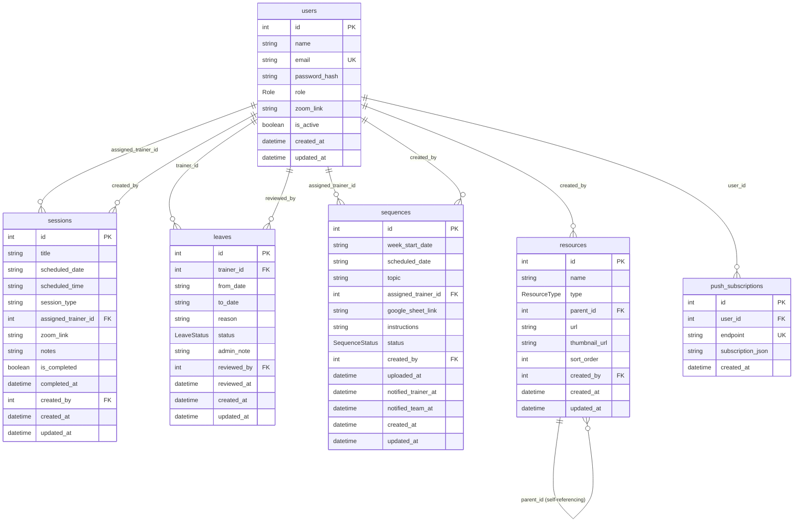

# DB Schema Diagram — Oneness Yoga Trainers App

**Database:** PostgreSQL (`OnenessYogaTrainersApp`) via Prisma ORM 6.19.3
**Source of truth:** `backend/prisma/schema.prisma`
**Last generated:** 12 July 2026

Renders natively on GitHub and in VS Code (with a Mermaid preview extension).

## Enums

| Enum | Values |
|---|---|
| `Role` | `super_admin`, `sequence_creator`, `trainer` |
| `LeaveStatus` | `pending`, `approved`, `rejected` |
| `SequenceStatus` | `pending`, `uploaded` |
| `ResourceType` | `folder`, `link` |

## Notes

- All foreign keys reference `users.id` except `resources.parent_id`, which self-references `resources.id` (cascade delete — deleting a folder deletes its children).
- Field names are snake_case to match the original SQLite schema, so API responses and the frontend needed no changes after the Postgres migration.
- `sessions.assigned_trainer_id` uses `onDelete: SetNull`; `leaves.trainer_id` and `push_subscriptions.user_id` use `onDelete: Cascade`.
- Update this file whenever `schema.prisma` changes, and reference it from the PRD (Section 6.1a).
